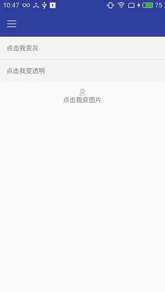

#点击按钮的动画
### 一.点击动画效果在toolbar里面的话，建议使用水波纹效果。在需要加点击的布局中加入背景为：
    android:background="?attr/selectableItemBackgroundBorderless"
### 二.点击动画效果用selector来实现，这个方法是最通用的方法。
    <?xml version="1.0" encoding="utf-8"?>
    <selector xmlns:android="http://schemas.android.com/apk/res/android">
	    <item android:state_enabled="false">
		    <shape>
		    <solid android:color="@color/colorPageBg" />
		    </shape>
	    </item>
	    <item android:state_pressed="true">
		    <shape>
		    <solid android:color="@color/itemLowBackground" />
		    </shape>
	    </item>
	    <item android:state_pressed="false">
		    <shape>
		    <solid android:color="@color/colorPageBg" />
		    </shape>
	    </item>
    </selector>
### 下面这段是改变图片实现点击效果，注意可以通过下载自动生成selector插件来很方便的生成切换动画效果。但是要注意，图片的命名方式，结尾需要是normal,pressed等等。
    <?xml version="1.0" encoding="UTF-8"?>
    <selector xmlns:android="http://schemas.android.com/apk/res/android">
	    <item android:drawable="@drawable/me_icon_normal" android:state_pressed="false"/>
	    <item android:drawable="@drawable/me_icon_pressed" android:state_pressed="true"/>
    </selector>
### 三.通过改变透明度，去改变点击动画，首先也需要写一个改变透明度的xml文件。
    <?xml version="1.0" encoding="utf-8"?>
    <set xmlns:android="http://schemas.android.com/apk/res/android" >
	    <alpha
		    android:fromAlpha="0.1"
		    android:toAlpha="1.0"
		    android:duration="100"
	    /> 
    </set>
### 编写点击事件的时候，启动动画。
    public void onClick(View view) {
	    Animation animation = AnimationUtils.loadAnimation(mContext, R.anim.alpha);
	    switch (view.getId()){
		    case R.id.tv_alpha:
			    tv_alpha.startAnimation(animation);
			    Toast.makeText(mContext,"注意我的透明变化效果",Toast.LENGTH_SHORT).show();
		    break;
	    }
    }
### 截图
